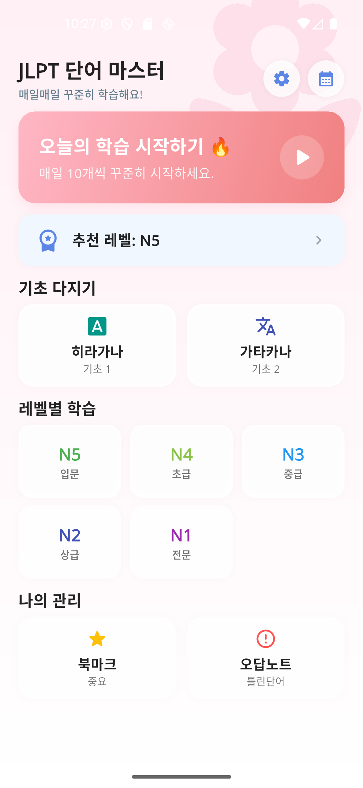
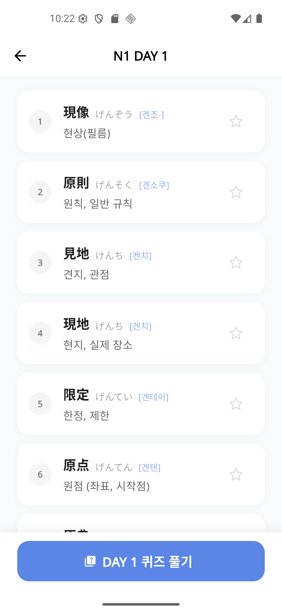
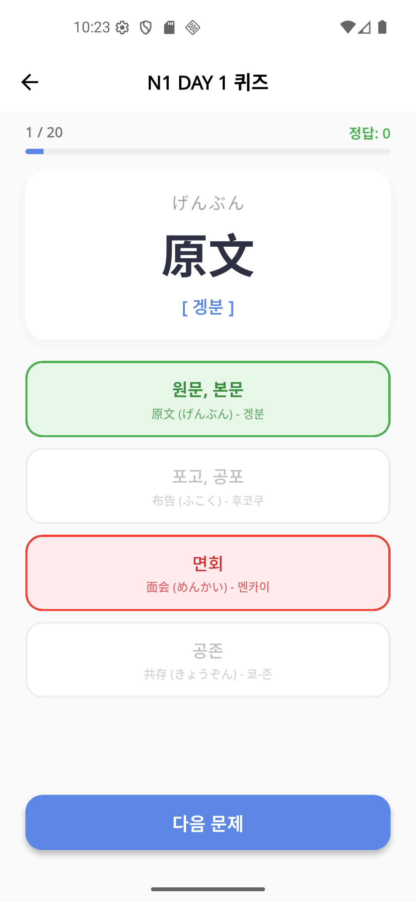
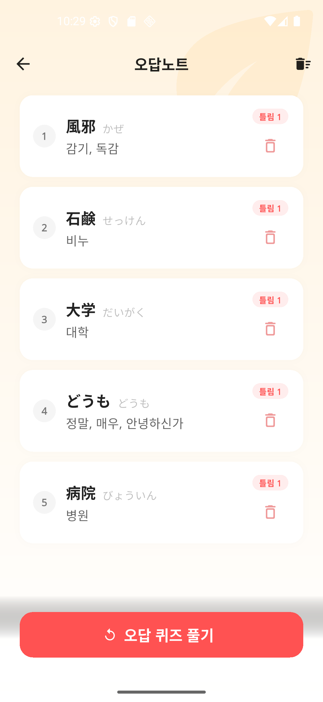
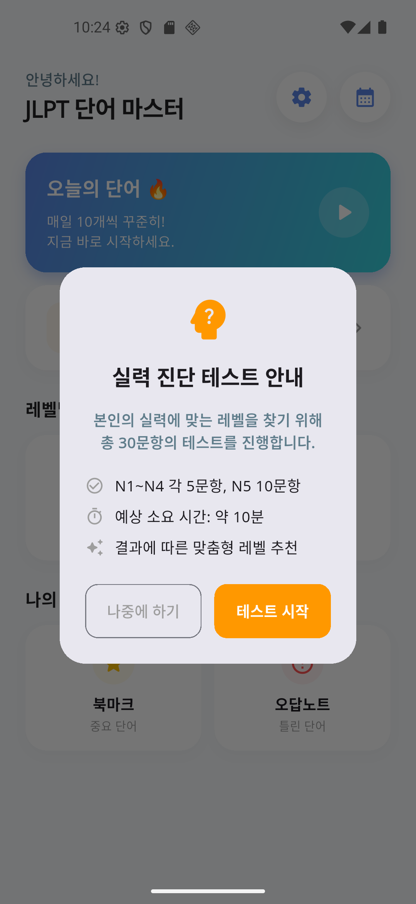
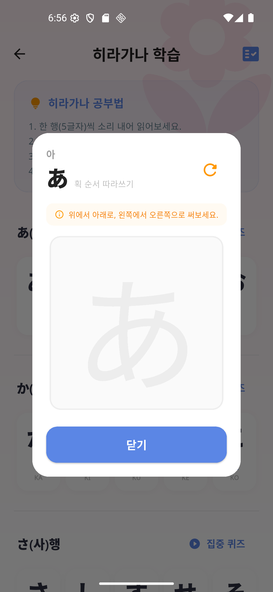

  

# 🌸 냥냥 일본어 (Nyang Nyang Japanese) - JLPT 단어장

**냥냥 일본어**는 JLPT(일본어 능력 시험) 합격을 목표로 하는 초보자부터 상급자까지, N1부터 N5까지의 필수 단어를 쉽고 체계적으로 암기할 수 있도록 도와주는 감성적인 Flutter 기반 어플리케이션입니다.

---

## ✨ 최근 업데이트의 주요 특징 (New Features)

학습 효율을 극대화하고 사용자 피드백을 반영한 강력한 기능들이 추가되었습니다.

### 1. ✍️ 히라가나/가타카나 따라 쓰기 (Handwriting Practice)
*   **붓글씨 모드**: `signature` 패키지를 활용하여 실제 붓으로 쓰는 듯한 묵직한 필기감(10px 두께)을 구현했습니다.
*   **획 순서 가이드**: 글자 배경에 흐릿한 가이드를 배치하여 초보자도 쉽게 획 순서를 익힐 수 있습니다.
*   **새로고침 기능**: 언제든 캔버스를 비우고 무한 반복 연습이 가능합니다.

### 2. 🧠 지능형 퀴즈 시스템 (Smart Quiz Logic)
*   **레벨별 맞춤 발음 제어**: 상급 레벨(N1~N3) 퀴즈는 정답을 맞히기 전까지 한국어 발음이 보이지 않도록 설계하여 암기 효과를 극대화했습니다.
*   **오늘의 학습 예외 처리**: '오늘의 단어' 퀴즈에서는 모든 레벨의 발음이 노출되어 학습 부담을 낮췄습니다.
*   **유연한 네비게이션**: 퀴즈 종료 후 '다시 도전하기'뿐만 아니라 즉시 '메인으로 이동'할 수 있는 기능을 추가했습니다.

### 3. 📅 고정된 무작위 순서 (Deterministic Shuffle)
*   **학습 일관성 확보**: `Random(Seed)` 기반 정렬을 통해, 단어들이 적절히 섞여 있으면서도 매번 접속 시마다 동일한 DAY 구성을 유지하도록 버그를 완벽히 해결했습니다.
*   **한국어 발음 표기**: 모든 단어 학습 리스트에 한국어 발음을 추가하고, 긴 단어도 잘림 없이(`Wrap` 레이아웃) 표시되도록 UI를 개선했습니다.

---

## 🎨 테마 및 편의 기능

### 1. 사계절 테마 시스템 (Seasonal Background)
*   **지능형 계절 감지**: 현재 날짜에 맞춰 봄🌸, 여름🌊, 가을🍁, 겨울❄️ 배경이 자동으로 적용됩니다.
*   **다크 모드**: 눈의 피로를 줄여주는 고급스러운 다크 테마를 완벽 지원합니다.

### 2. 강화된 오답노트
*   **레벨 배지**: 오답 리스트에서 각 단어가 몇 급(N1~N5)인지 한눈에 확인할 수 있는 배지를 추가했습니다.
*   **오답 퀴즈**: 틀린 단어들만 모아서 다시 퀴즈를 풀어보는 집중 학습 모드를 지원합니다.

---

## 📱 주요 기능

- **레벨별 단어 학습**: JLPT N1 ~ N5 단계별 필수 단어 제공
- **에빙하우스 복습 시스템 (SRS)**: 망각 곡선을 기반으로 최적화된 복습 알고리즘 적용
- **오늘의 단어**: 매일 20개씩 꾸준히 학습할 수 있는 맞춤형 세션
- **히라가나/가타카나 학습**: 행 단위 집중 퀴즈 및 따라 쓰기 연습장
- **학습 통계 & 캘린더**: 나의 진도율과 연속 학습 일수를 시각적으로 확인

---

## 📸 Screenshots

| 메인 화면 | 단어 리스트 | 퀴즈 화면 |
| :---: | :---: | :---: |
|  |  |  |

| 따라 쓰기 | 오답노트 | 실력 테스트 | 따라 쓰기 |
| :---: | :---: | :---: | :---: |
|  |  |  |  |

---

## 🛠 Tech Stack

- **Framework**: [Flutter](https://flutter.dev/) (Material 3)
- **Language**: [Dart](https://dart.dev/)
- **Database**: [Hive](https://pub.dev/packages/hive) (고성능 로컬 NoSQL 데이터베이스)
- **Signature**: [signature](https://pub.dev/packages/signature) (Handwriting Engine)
- **State Management**: [Provider](https://pub.dev/packages/provider)
- **Animations**: Custom PageTransitions & Lottie
- **Localization**: `Intl`

---

## 🚀 시작하기

1. 저장소 클론: `git clone https://github.com/your-username/my_voca_japan_app.git`
2. 패키지 설치: `flutter pub get`
3. Hive 어댑터 생성: `dart run build_runner build`
4. 앱 실행: `flutter run`

---
*JLPT 합격을 응원합니다! 냥냥 일본어와 함께 즐겁게 공부하세요! 🇯🇵*
