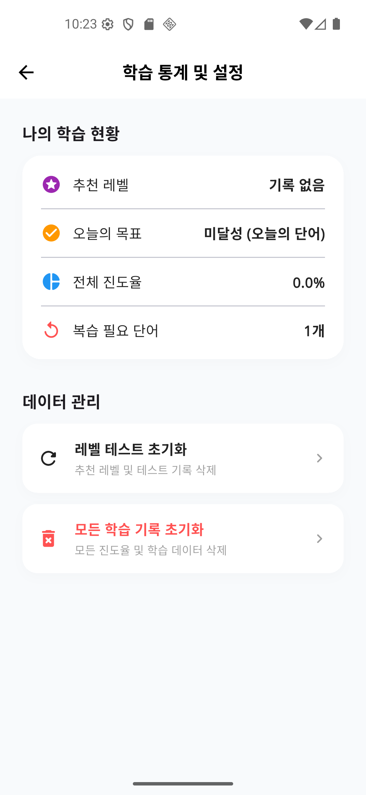

# 냥냥일본어 (Nyang Nyang Japanese) - JLPT 단어장 🐾

**냥냥일본어**는 JLPT(일본어 능력 시험) 합격을 위해 N1부터 N5까지의 핵심 단어를 쉽고 재미있게 학습할 수 있도록 도와주는 Flutter 기반 모바일 애플리케이션입니다.

## ✨ 주요 기능

- **📖 수준별 단어 학습**: JLPT N1, N2, N3, N4, N5 단계별 핵심 단어 제공
- **🧠 스마트 복습 시스템 (SRS)**: 에빙하우스 망각곡선 기반 알고리즘이 적용된 '오늘의 단어'를 통해 장기 기억 형성 도우미
- **📝 퀴즈 모드**: 객관식 퀴즈를 통해 학습한 단어를 복습하고 실력을 점검
- **⭐ 북마크**: 헷갈리거나 어려운 단어는 따로 저장하여 집중 학습
- **📅 학습 통계 & 캘린더**: 학습 이력을 달력으로 확인하고, 시각화된 차트로 나의 성장 확인
- **❌ 오답 노트**: 퀴즈에서 틀린 단어들만 모아 다시 공부
- **📈 레벨 테스트**: 현재 나의 일본어 실력을 테스트하고 적합한 급수 확인

## 🧠 에빙하우스 망각곡선 복습 알고리즘

본 앱의 **'오늘의 단어'** 기능에는 과학적인 학습법인 **간격 반복(Spaced Repetition)** 알고리즘이 적용되어 있습니다.

- **자동 복습 관리**: 단어별 학습 이력을 추적하여, 잊어버리기 직전 최적의 타이밍에 복습 단어로 자동 선정합니다.
- **단계별 학습**: 정답을 맞힐수록 복습 주기가 늘어납니다 (1일 -> 2일 -> 4일 -> 7일 -> 14일 -> 30일).
- **집중 학습**: 틀린 단어는 즉시 0단계로 초기화되어 완벽히 외울 때까지 반복 노출됩니다.

## 📸 Screenshots

| 홈 화면 | 단어 리스트 | 퀴즈 화면 |
| :---: | :---: | :---: |
|  |  |  |

| 통계 화면 | 오답 노트 | 레벨 테스트 |
| :---: | :---: | :---: |
|  |  |  |

## 🛠 Tech Stack

- **Framework**: [Flutter](https://flutter.dev/) (Material 3)
- **Language**: [Dart](https://dart.dev/)
- **Database**: [Hive](https://pub.dev/packages/hive) (고성능 로컬 NoSQL 데이터베이스)
- **State Management**: [Provider](https://pub.dev/packages/provider)
- **UI & Graphics**:
  - `Table Calendar`: 학습 기록 시각화
  - `FL Chart`: 학습 통계 그래프
  - `Google Fonts`: 가독성 높은 Noto Sans 폰트 적용
- **Localization**: `Intl` (한국어 날짜 및 시간 형식 지원)

## 🚀 시작하기

### 사전 요구 사항
- Flutter SDK (버전 3.11.0 이상 권장)
- Android Studio 또는 VS Code

### 설치 및 실행
1. 저장소 클론:
   ```bash
   git clone https://github.com/your-username/my_voca_japan_app.git
   ```
2. 패키지 설치:
   ```bash
   flutter pub get
   ```
3. (필요 시) Hive 어댑터 생성:
   ```bash
   dart run build_runner build
   ```
4. 앱 실행:
   ```bash
   flutter run
   ```

## 📁 프로젝트 구조

```text
lib/
├── main.dart             # 앱 진입점 및 초기 설정
├── model/                # 데이터 모델 (Word, Adapter 등)
├── service/              # 데이터베이스 및 비즈니스 로직
├── view/                 # UI 페이지 (Home, Quiz, Statistics 등)
└── view_model/           # 상태 관리 및 UI 로직 분리
```

---
*JLPT 합격을 응원합니다! 냥냥!* 🐱
